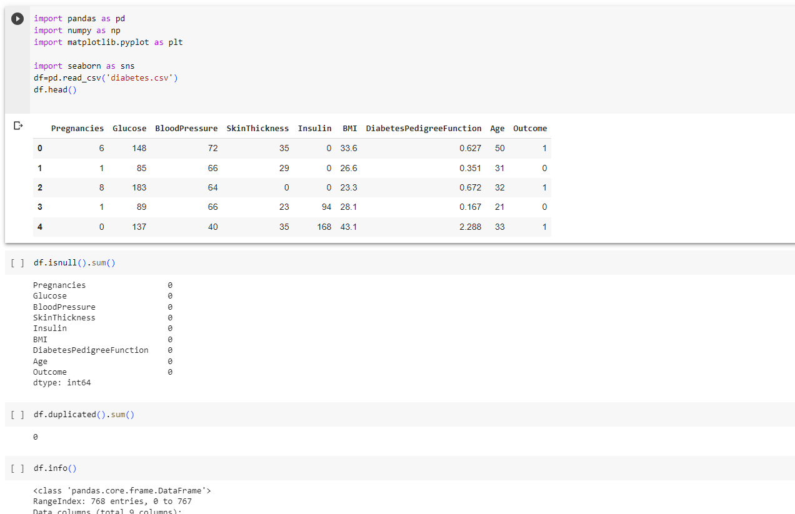
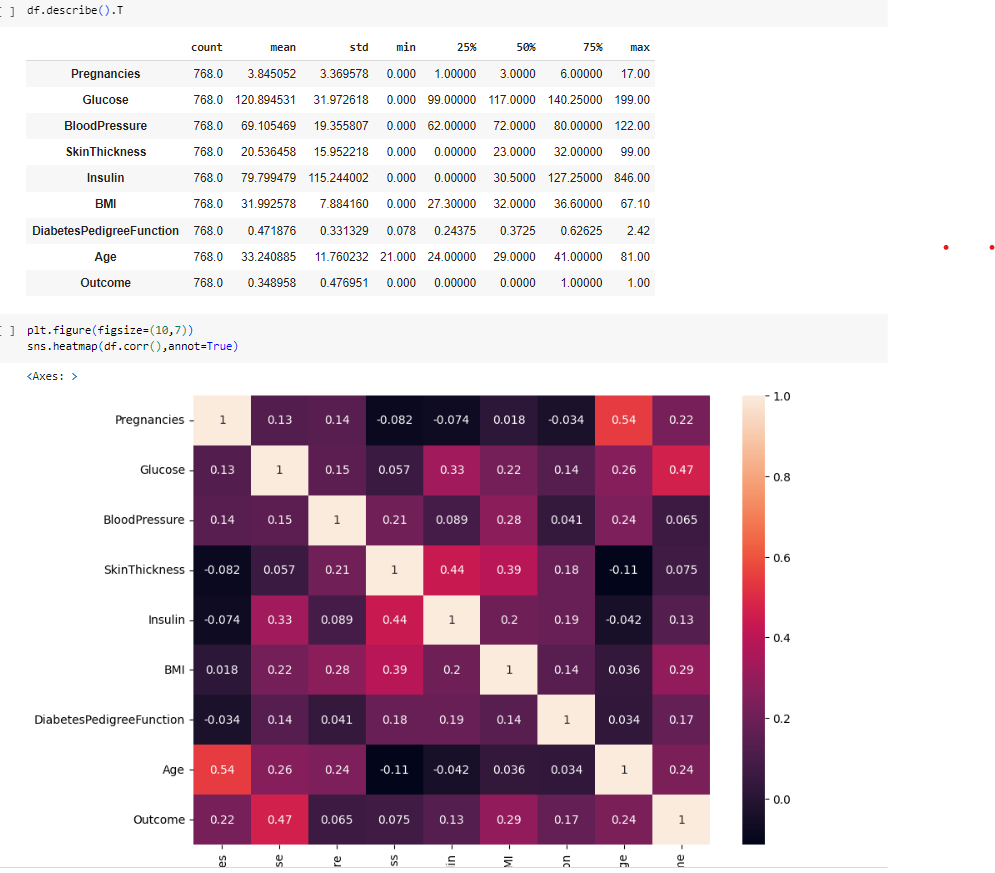
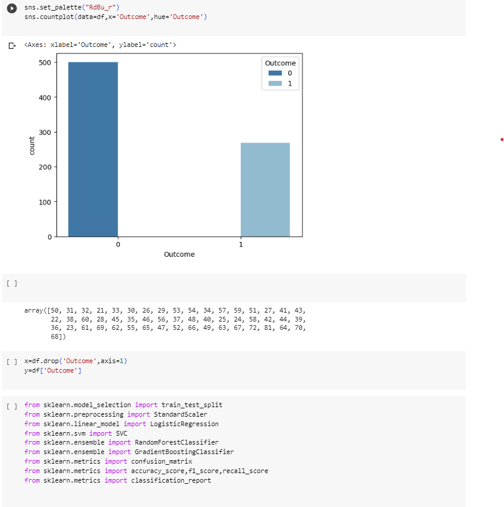
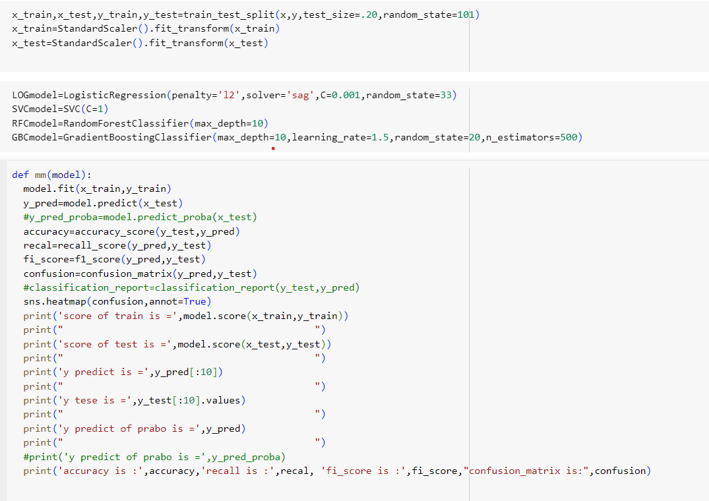
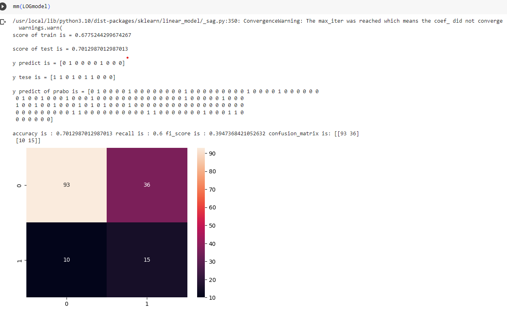
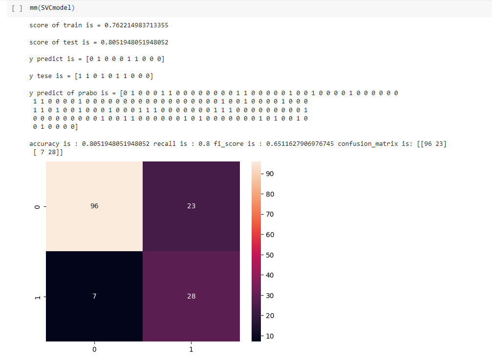
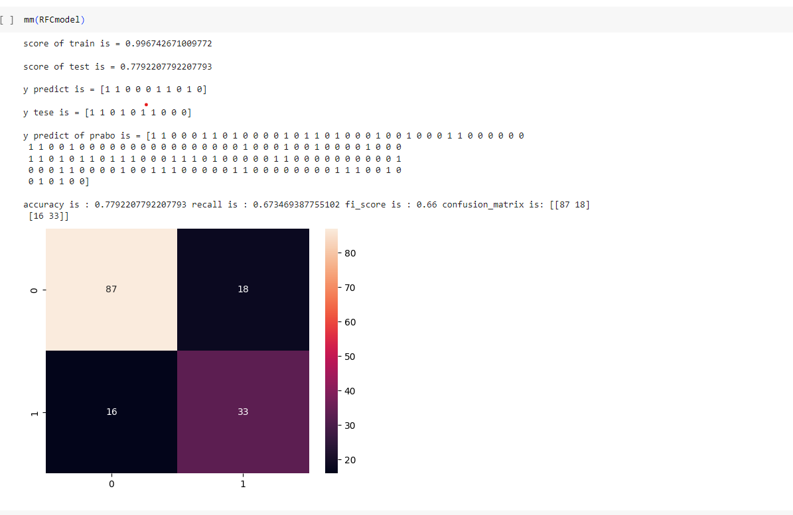
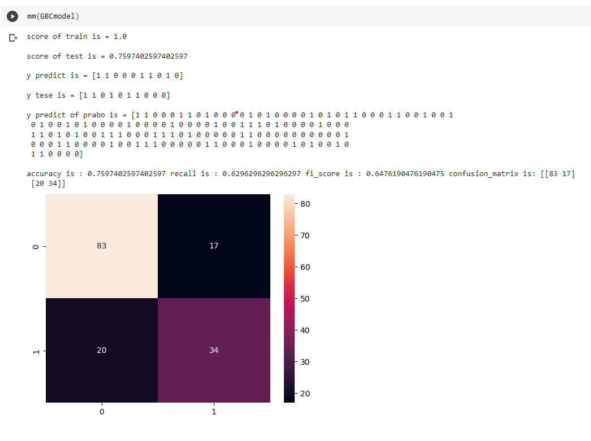

># PYTHON-Analyzing and MACHINE-diabates predicting
## What makes name timeless or trendy?
Using data published by the US Social Security Administration, which extends over a period of **one hundred years** to determine whether a resident has cancer or not.

## Creating and importing data 

```
import pandas as pd
import numpy as np
import matplotlib.pyplot as plt

import seaborn as sns
df=pd.read_csv('diabetes.csv')
df.head()
df.isnull().sum()

df.duplicated().sum()
```

-----------------

------------------------
## ANALYSIS DATA
```
df.describe().T
plt.figure(figsize=(10,7))
sns.heatmap(df.corr(),annot=True)

```

-----------------

```
df['Outcome'].value_counts()
sns.set_palette("RdBu_r")
sns.countplot(data=df,x='Outcome',hue='Outcome')

```


-----------------
Calculating accuracy and f1_score,recall_score,classification_report and score
```
def mm(model):
  model.fit(x_train,y_train)
  y_pred=model.predict(x_test)
  #y_pred_proba=model.predict_proba(x_test)
  accuracy=accuracy_score(y_test,y_pred)
  recal=recall_score(y_pred,y_test)
  fi_score=f1_score(y_pred,y_test)
  confusion=confusion_matrix(y_pred,y_test)
  #classification_report=classification_report(y_test,y_pred)
  sns.heatmap(confusion,annot=True)
  print('score of train is =',model.score(x_train,y_train))
  print("                                            ")
  print('score of test is =',model.score(x_test,y_test))
  print("                                            ")
  print('y predict is =',y_pred[:10])
  print("                                            ")
  print('y tese is =',y_test[:10].values)
  print("                                            ")
  print('y predict of prabo is =',y_pred)
  print("                                            ")
  #print('y predict of prabo is =',y_pred_proba)
  print('accuracy is :',accuracy,'recall is :',recal, 'fi_score is :',fi_score,"confusion_matrix is:",confusion)


```

-----------------------------------
## 2 :logisticregression model
```
mm(LOGmodel)
```
------------------------

------------------------
## 3 :SVC model
```
mm(SVCmodel)
```
---------------


------------------------
>## RandomForestClassifier model
```
mm(RFCmodel)
```
------------------------


--------------------------
>## GradientBoostingClassifier model
```
mm(GBCmodel)
```
------------------------


--------------------------

------------------------------------

-------------------------------
### THANK YOU♥
